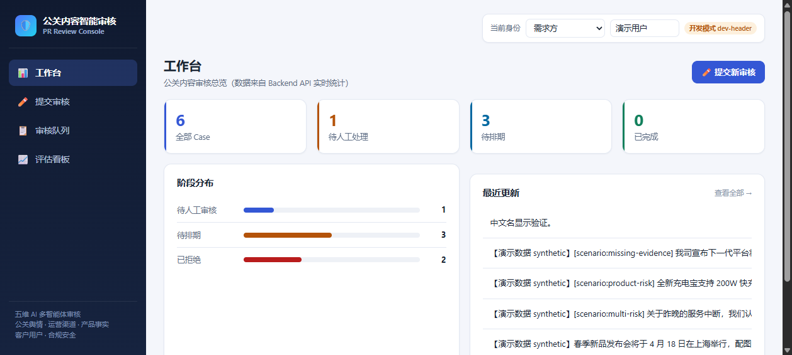
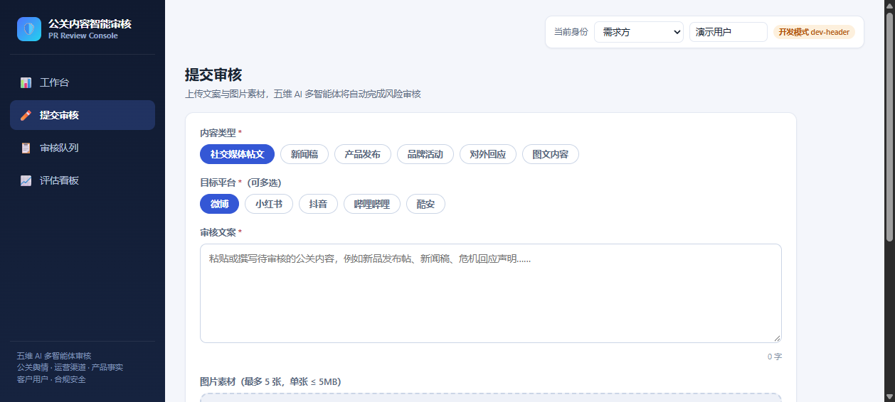
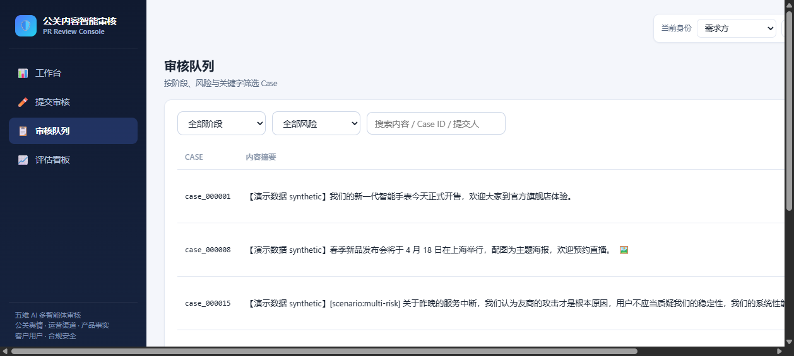
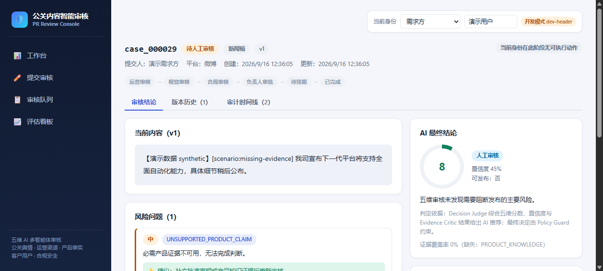

# 公关内容智能审核系统

企业公网内容发布前的 AI 多智能体审核平台：**五维风险审核 + 多级人工审批 + 多模态素材上传 + 不可变审计**。前后端分离，一键本地运行，零 API Key 可用。



## 功能

- **多模态内容提交**：文案 + 图片（PNG/JPG/GIF/WebP）+ 来源链接，支持拖拽上传，服务端魔数嗅探校验真实文件类型
- **五维 AI 审核**：公关与舆情 / 运营与渠道 / 产品与事实 / 客户与用户 / 合规与安全，五个智能体并行审核，每个维度独立输出 0–100 风险分、置信度、结论、问题定位与修改建议
- **风险路由**：PASS / REVISE / HUMAN_REVIEW / BLOCK 四级决策，确定性安全闸门，任何失败一律进入人工，绝不默认通过
- **多级人工审批流**：运营 → 视觉 → 合规 → 负责人逐级审批，角色 × 阶段权限矩阵，提交者不能自审，动作原因强制写入审计
- **不可变版本与对比**：每次修订生成新版本，旧版本只读，支持任意两版差异对比
- **审计时间线**：提交、路由、审批、修订、排期全程 append-only 留痕
- **模拟排期**：终审通过后 MockPublisher 一键排期，开发环境不存在真实发布
- **评估看板**：benchmark 指标只展示真实运行结果，无数据时显式「未计算」

| 提交审核 | 审核队列 |
| --- | --- |
|  |  |

| 审核详情（五维评分 / 风险问题 / AI 结论） |
| --- |
|  |

## 部署

环境要求：Node.js 22+、Yarn 1.22。

```bash
# 1. 安装依赖
yarn install
yarn --cwd apps/pr-review-console install

# 2. 构建前端
yarn pr-review:console:build

# 3. 启动（默认 http://127.0.0.1:3001）
yarn pr-review:server
```

浏览器打开 <http://127.0.0.1:3001> 即可使用。默认自带 5 条演示数据（`PR_REVIEW_DEMO_SEED=false` 可关闭）。

**开发模式**（前后端分离热更新）：

```bash
yarn pr-review:server     # 终端 1：后端 API，127.0.0.1:3001
yarn pr-review:console    # 终端 2：前端 Vite，127.0.0.1:5173
```

**可选配置**：复制 `.env.pr-review.example` 为 `.env`，可接入 DeepSeek / Qwen 真实模型（配置对应 API Key 与模型即可，详见 `docs/pr-review/06-environment-and-api-config.md`）。

## 配置 API Key

默认使用  模式，无需任何 API Key，直接启动即可使用完整控制台。

如需接入真实 LLM 审核，复制  为  并填写对应 provider 的 key：

| 环境变量 | Provider | 说明 |
| --- | --- | --- |
| `DEEPSEEK_API_KEY` | DeepSeek | 用于 LLM 智能体审核 |
| `DASHSCOPE_API_KEY` + `QWEN_BASE_URL` | Qwen (阿里云) | 用于 LLM 智能体审核 + 视觉多模态分析 |
| `PR_REVIEW_EXECUTION_MODE` | — | 设为 `hybrid` 启用真实 LLM 审核（默认 `mock`） |
| `PR_REVIEW_VISION_PROVIDER=qwen` | — | 启用 Qwen VL 图片视觉分析 |

详细配置见 [docs/pr-review/06-environment-and-api-config.md](docs/pr-review/06-environment-and-api-config.md)。

## 文档

产品设计、架构、API 合同与开发规范见 [`docs/pr-review/`](./docs/pr-review/)。

## License

MIT
